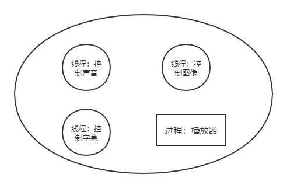
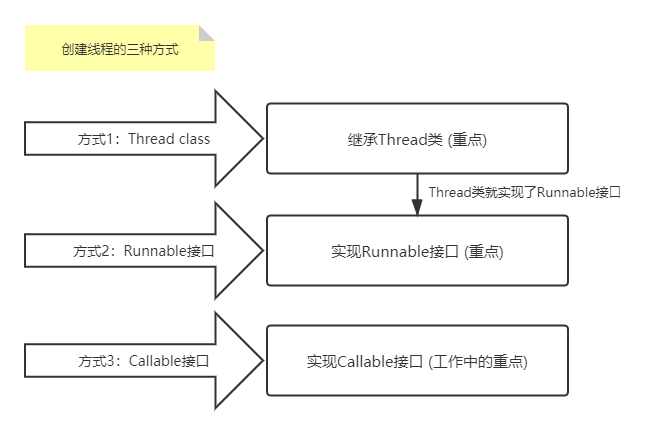

# 多线程学习笔记 Java.Thread

## 2020.12.22记录

## 线程、进程、多线程

**多任务：**比如边吃饭边玩手机，虽然看起来是多个任务同时在做，其实本质上我们的大脑在同一时刻依旧只做了一件事情。

**多线程：**比如说单车道的马路，容易造成道路阻塞，效率低 ---> 多车道，提高效率。两个人同时游戏。

## 程序、进程(Process)、线程(Thread)

在操作系统中运行的程序就是进程，比如QQ、播放器、游戏和 IDEA 等等。。

而一个进程中可以有多个线程，如视频中同时听到的声音、图像、弹幕等等。。



+ 程序：是指令和数据的有序集合，其本身没有任何运行的含义，是一个静态的概念。
+ 进程：是执行程序的一次执行过程，它是一个动态的概念。是资源分配的单位。
+ 线程：通常一个进程之中包含若干个线程，当然一个进程中至少有一个线程；不然没有存在的意义。线程是 CPU 调度和执行的单位。==真正执行的是线程！！！==

**注意：**很多多线程是模拟出来的，真正的多线程是指有多个 CPU，即多核，如服务器。如果是模拟出来的线程，在同一个时间点，CPU 只能执行一个代码，因为切换的速度很快，所以就有同时执行的错觉。

核心概念：

+ 线程就是独立的执行路径，比如有一个 main 线程，还有一个 GC(垃圾回收线程，JVM 提供的，守护线程)，main 线程结束了，GC 也就结束了；
+ 在程序运行时，即使没有自己创建线程，后台也会有多个线程，如主线程和 gc 线程；
+ main() 线程是主线程(用户线程)，为系统的入口，用于执行整个程序，自己写的线程也在 main() 线程里；
+ 在一个线程中，如果开辟了多个线程，线程的运行由调度器安排调度，调度器是与操作系统密切相关的，先后顺序是不能人为的干预的；
+ 对应同一份资源，会存在资源抢夺的问题，需要加入并发的控制；
+ 线程会带来额外的开销，如 CPU 调度时间，并发控制开销等；
+ 每个线程都在自己的工作内存交互，内存控制不当会造成数据不一致。

## 线程创建



1. 继承 Thread 类，重写 run() 方法，调用 start 开启线程

```java
public class TestThread1 extends Thread {
    @Override
    public void run() {
        // run 方法线程体
        for (int i; i < 20; i++) {
            System.out.println(i);
        }
    }
    
    public static void main(String[] args) {
        // main 线程，主线程
        
        // 创建一个线程对象，调用start方法开启线程
        TestThread1 testThread1 = new TestThread1();
        // 调用start方法开启线程
        testThread1,start();
        for (int i; i < 20; i++) {
            System.out.println("主线程" + i);
        }
    }
}
```

注意：线程开启不一定立即执行，由 CPU 进行调度！

参考工程中 Demo 库中的 ThreadTest 类


2. 实现Runnable接口，重写run方法，执行线程需要丢入Runnable接口的实现类，调用start方法。

+ 定义 MyRunnable 类实现 Runnable 接口
+ 实现 run() 方法，编写线程执行体
+ 创建线程对象，调用 start() 方法启动线程

```java
// 创建线程方式2：实现Runnable接口，重写run方法，执行线程需要丢入Runnable接口的实现类，调用start方法。
public class ThreadTest1 implements Runnable{
    @Override
    public void run() {
        // run 方法线程体
        for (int i = 0; i < 200; i++) {
            System.out.println("我在看代码---" + i);
        }
    }

    public static void main(String[] args) {
        // 创建一个 Runnable 接口的实现类
        ThreadTest1 threadTest1 = new ThreadTest1();

        // 创建一个线程类,通过线程对象开启我们的线程
//        Thread t1 = new Thread(threadTest1);
//        t1.start();

        new Thread(threadTest1).start();

        for (int i = 0; i < 1000; i++) {
            System.out.println("我在学习多线程---" + i);
        }
    }
}
```

### 利用 Thread 类和 Runnable 接口实现线程的区别

1. 继承 Thread 类

+ 子类继承 Thread 类具备多线程能力
+ 启动线程：子类对象.start()
+ ==不建议使用：避免 Java 面向对象的单继承的局限性==

2. 继承 Runnable 接口

+ 实现 Runnable 接口具备多线程能力
+ 启动线程：new Thread(Runnable 接口的实现类).start()
+ ==避免单继承的局限性，灵活方便，方便同一个对象被多个线程使用。==

---

# 2020.12.23记录

Java 中 jar 包的下载地址：https://mvnrepository.com/artifact/commons-io/commons-io/2.8.0

## IDEA 操作

1. 点击 .java 文件，右击 --> Split_Vertically 即可实现分屏
2. 下载 jar 包要添加到工程的 lib 目录下，没有就自己新建一个。然后右键 jar 包 --> Add as library


---

# 2020.12.20记录

```java
Thread.currentThread().getName(); // 获取当前线程的名字
```


## 线程安全问题

### 多线程操作同一个对象会引发安全问题

**案例：**

```java
// 实现多个线程操作同一个对象
// 买回车票的例子
// 发现问题：多个线程操作同一个资源的情况下，线程不安全，数据紊乱
public class ThreadTest3 implements Runnable{

    // 票数
    private int ticketNums = 10;

    @Override
    public void run() {
        while (true) {
            if (ticketNums <= 0) {
                break;
            }
            // 模拟延迟
            try {
                Thread.sleep(200); // 延迟两百毫秒
            } catch (InterruptedException e) {
                e.printStackTrace();
            }
            System.out.println(Thread.currentThread().getName() + "-->拿到了第" + ticketNums-- + "票");
        }
    }

    public static void main(String[] args) {
        ThreadTest3 ticket = new ThreadTest3();

        new Thread(ticket, "小明").start();
        new Thread(ticket, "老师").start();
        new Thread(ticket, "黄牛").start();
    }
}
```

**结果：**

```java
黄牛-->拿到了第10票
老师-->拿到了第9票
小明-->拿到了第8票
黄牛-->拿到了第7票
老师-->拿到了第6票
小明-->拿到了第5票
黄牛-->拿到了第4票
小明-->拿到了第2票
老师-->拿到了第3票
小明-->拿到了第1票
黄牛-->拿到了第-1票
老师-->拿到了第0票
Process finished with exit code 0
```

此时会出现不同的线程(对应老师、小明和黄牛)会拿到同一张票的情况，导致数据紊乱不安全。

3. 实现 Callable 接口

+ 实现 Callable 接口，需要返回值类型
+ 重写 call 方法，需要抛出异常
+ 创建目标对象
+ 创建执行服务：ExecutorService ser = Executor.newFixedThreadPool(1);
+ 提交执行：Future\<Bollean> result1 = ser.submit(t1);
+ 获取结果：boolean r1 = result1.get();
+ 关闭服务：ser.shoutdownNow();